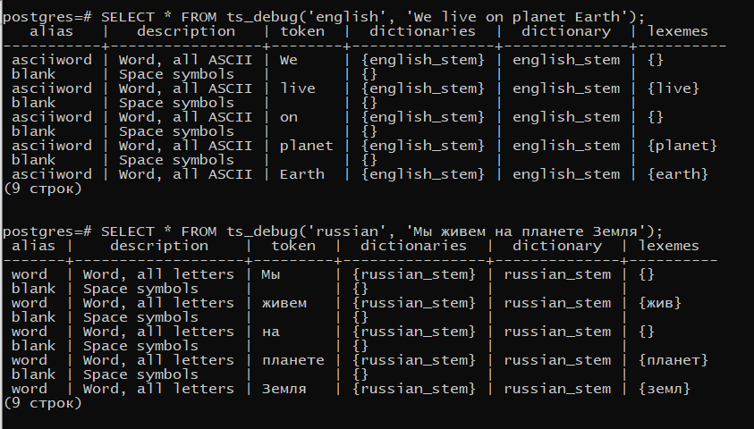

### 1. Тип tsvector()

**to_tsvector** расшифровывается как "text search", tsvector - особый тип данных, представляющий собой документ в виде, оптимизированном для текстового поиска. tsvector содержит отсортированный список неповторяющихся лексем, т. е. слов, нормализованных так, что все словоформы сводятся к одной.

После выполнения операции команда возвращает лексемы и числа, обозначающие указатели на расположение в документе. Неосмысленные слова, такие как предлоги, союзы, междометия и т.д. - отбрасываются, поэтому в первом запросе среди лексем нет, например, предлога *The*, а среди русских лексем отсутствует союз *да*.

-- (1)

- **SELECT to_tsvector('The quick brown fox jumped over the lazy dog.');**

-- (2) выполняем тот же запрос, но с другим текстом

- **SELECT to_tsvector('Съешь ещё этих мягких французских булок, да выпей чаю');**

### 2. Тип tsquery()

**tsvector** содержит отсортированный список лексем. Отличие от tsvector состоит в уникальности каждой лексемы, т.е. они не повторяются.

Полнотекстовый поиск в PostgreSQL основан на операторе сопоставления @@, который возвращает *true*, если tsvector (документ) соответствует tsquery (запросу), при этом порядок типов данных не важен.

-- (1)

- **SELECT to_tsvector('The quick brown fox jumped over the lazy dog') @@ to_tsquery('fox');**

- **SELECT to_tsvector('The quick brown fox jumped over the lazy dog') @@ to_tsquery('foxes');**

- **SELECT to_tsvector('The quick brown fox jumped over the lazy dog') @@ to_tsquery('foxhound');**

Последний запрос возвращает false, т.к. лексема слова 'foxhound' является само же слово, и его нет среди лексем предложения, в котором производится поиск.

- **SELECT to_tsvector('Russian', 'Съешь ещё этих мягких французских булок, да выпей чаю.') @@ to_tsquery('Russian','булка');**

Выполним запрос для русского текста. Как видно, первый запрос также возвратил значение false, т.к. лексема tsquery отсутствует среди лексем предложения, в котором осуществляется поиск.

По-другому проверить лексему можно через запрос **select ts_lexise()**

- **SELECT to_tsvector('Russian', 'Съешь ещё этих мягких французских пирожков, да выпей чаю.') @@ to_tsquery('Russian','пирожки');**

- **SELECT to_tsvector('Russian', 'Съешь ещё этих мягких французских пирожков, да выпей чаю.') @@ to_tsquery('Russian','пирожок');**

Лексемы слов пирожков и пирожки совпадают, поэтому первый запрос возварщает значение true. Последний же запрос возвращает false, т.к. не совпадают, соответственно.

### 3. Операторы

& - Логическое И

|| - Логическое ИЛИ

! - Логическое НЕ

--И
- **SELECT to_tsvector('The quick brown fox jumped over the lazy dog') @@ to_tsquery('fox & dog');**

--ИЛИ
- **SELECT to_tsvector('The quick brown fox jumped over the lazy dog') @@ to_tsquery('fox | rat');**

--отрицание
- **SELECT to_tsvector('The quick brown fox jumped over the lazy dog') @@ to_tsquery('!clown');**

--группировка
- **SELECT to_tsvector('The quick brown fox jumped over the lazy dog') @@ to_tsquery('fox & (dog | rat) & !mice');**

--И
- **SELECT to_tsvector('Полет на корабле "Восток" был сопряжен с огромными рисками для жизни Гагарина') @@ to_tsquery('Russian', 'Гагарина & Восток');**

--ИЛИ
- **SELECT to_tsvector('Полет на корабле "Восток" был сопряжен с огромными рисками для жизни Гагарина') @@ to_tsquery('Russian', 'Гагарин | Королев');**

--отрицание
- **SELECT to_tsvector('Полет на корабле "Восток" был сопряжен с огромными рисками для жизни Гагарина') @@ to_tsquery('Russian', '!Королев');**

--группировка
- **SELECT to_tsvector('Полет на корабле "Восток" был сопряжен с огромными рисками для жизни Гагарина') @@ to_tsquery('Russian', 'полет & Гагарин | (Королев & !Байконур)');**

1, 2, 4 запросы возвращают значение True

3 запрос возвращает False, т.к. в среди лексем текста присутствует лексема слова Гагарин, что противоречит запросу

Первый аргумент **regconfig**, обозначающий язык, имеет значение по умолчанию 'english', поэтому при работе с английский языком его можно не указывать. Если используется другой язык, то указывать его нужно обязательно.

### 4. Поиск фраз

Для более точного поиска в PostgresQL используется оператор <-> вместо &, позволяющий искать близость слов или расстояние. Эта функция полезна при поиске точных последовательностей лексем, поскольку операторы FOLLOWED BY проверяют порядок лексем, а не только наличие всех лексем. Возможно использовать вариант оператора <N>, где N - целочисленное значение [1,2,3,...], обозначающее расстояние между лексемами (ведь каждая лексема tsvector имеет свой номер расположения в документе)

- **SELECT to_tsvector('Russian', 'Съешь ещё этих мягких французских булок, да выпей чаю.') @@ to_tsquery('Russian','мягких<2>булок');**

Лексема МЯГК имеет номер 4, БУЛОК - 6: разница между ними = 2

Модифицируем запрос, чтобы находились слова СЪЕШЬ и ЕЩЁ

- **SELECT to_tsvector('Russian', 'Съешь ещё этих мягких французских булок, да выпей чаю.') @@ to_tsquery('Russian','съешь<->ещё');**

phraseto_tsquery приводит запрос к типу данных tsquery. Между оставшимися операторами использует <->

### 5. Утилиты

**ts_debug** позволяет тестировать конфигурацию поискового запроса. В результате выполнения команды отображается информация о каждом токене документа, произведенном синтаксическим анализатором и обработанном настроенными словарями

Пример:

**ts_headline** - выделяет часть документа и показывает, как он связан с запросом.

Пример:

